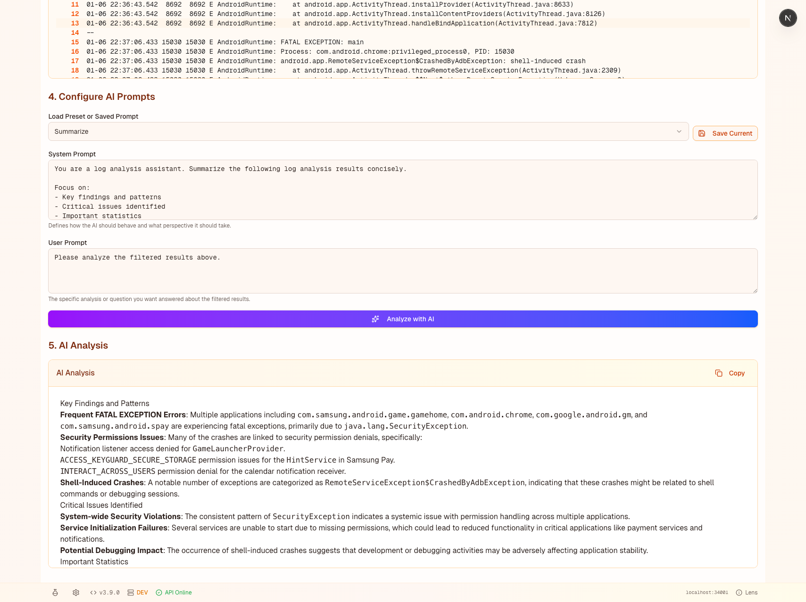

# Playground Feature

The Playground is an interactive environment for experimenting with ripgrep filters and AI prompts in real-time. It allows you to quickly test different filter configurations and see how AI analyzes the results, making it perfect for iterating on log analysis strategies.


*Sections 1-3: File selection, ripgrep filter configuration, and filtered results with performance metrics*


*Sections 4-5: AI prompt configuration and streaming analysis results*

## Overview

The Playground provides a complete workflow for:
1. **Filtering logs** with ripgrep using custom patterns and flags
2. **Iterating quickly** on filter configurations with instant feedback
3. **Analyzing results** with AI using customizable prompts
4. **Saving templates** for reusable prompt configurations

All settings are persisted to browser localStorage, so your configuration is preserved across sessions.

## Accessing the Playground

1. **From the main page**: Click the flask icon (🧪) in the status bar at the bottom
2. **Direct URL**: Navigate to `http://localhost:34000/playground` (or your configured port)

## Workflow

### Step 1: Select File

Enter the absolute path to a log file on the server that you want to analyze.

**Example:**
```
/Users/hanifm/awebees/backend/samples/android-bugreport.txt
```

### Step 2: Configure Ripgrep Filter

The Playground uses **ripgrep** (rg) for fast pattern matching. You can configure filters using multiple options:

#### Pattern (Required)
Enter a ripgrep-compatible regex pattern to search for.

**Examples:**
- `FATAL|EXCEPTION` - Find lines with FATAL or EXCEPTION
- `ERROR.*timeout` - Find errors with timeout
- `\b(failed|error|crash)\b` - Word boundary matches

#### Custom Flags (Optional)
Add any ripgrep command-line flags for advanced filtering.

**Common flags:**
- `--multiline` - Enable multi-line pattern matching
- `--pcre2` - Use PCRE2 regex engine for advanced patterns
- `--max-count 500` - Limit to first 500 matches
- `--only-matching` - Show only the matching part
- `--before-context 10` - Show 10 lines before each match (can also use `-B 10`)

**Example:**
```
--multiline --pcre2 --max-count 500
```

#### UI Helper Options

These options work alongside custom flags:

- **Case insensitive** - Add `--ignore-case` flag automatically
- **Lines before** - Show N lines of context before each match
- **Lines after** - Show N lines of context after each match

**Note:** The UI helpers are applied in addition to any custom flags you specify, giving you maximum flexibility.

### Step 3: Filtered Results

After clicking **Run Filter**, you'll see:

- **Performance metrics**: Number of lines found and execution time
- **Command display**: The exact ripgrep command that was executed
- **Highlighted results**: Log lines with numbered lines and orange theme
- **Copy button**: Quickly copy all filtered results to clipboard

**Example output:**
```
153 lines found  0.025s

$ rg FATAL EXCEPTION /path/to/file.txt --ignore-case --after-context 5
```

### Step 4: Configure AI Prompts

Once you have filtered results, you can analyze them with AI.

#### Prompt Templates

**Load Preset or Saved Prompts:**
- **Built-in presets**: Summarize, Explain, Find Root Cause, Security Analysis
- **Custom saved prompts**: Your own templates saved for reuse

#### System Prompt
Defines how the AI should behave and what perspective it should take.

**Example:**
```
You are a log analysis assistant. Summarize the following log analysis results concisely.

Focus on:
- Key findings and patterns
- Critical issues identified
- Important statistics
```

#### User Prompt
The specific analysis or question you want answered about the filtered results.

**Example:**
```
Please analyze the filtered results above and identify:
1. What type of crashes are occurring?
2. Which apps or services are affected?
3. What are the common causes?
```

#### Managing Prompts

- **Save Current**: Save your current system + user prompts as a template
- **Load**: Select from dropdown to load a saved or preset prompt
- **Delete**: Remove custom saved prompts (presets cannot be deleted)
- **Export/Import**: Share prompt templates with others

### Step 5: AI Analysis

Click **Analyze with AI** to send the filtered results to the AI service.

**Features:**
- **Real-time streaming**: See the analysis appear as the AI generates it
- **Markdown rendering**: Formatted output with headings, lists, and code blocks
- **Copy button**: Copy the full AI response
- **Error handling**: Clear error messages if analysis fails

**Performance Note:** The backend automatically limits AI input to 300 lines to control API costs. If your filtered results exceed this, only the first 300 lines will be analyzed.

## Tips & Best Practices

### Effective Filtering

1. **Start broad, then narrow**: Begin with a general pattern, then add flags to refine
2. **Use context lines**: Add `--before-context` and `--after-context` to see surrounding log lines
3. **Limit results**: Use `--max-count` to avoid overwhelming output
4. **Test patterns incrementally**: Adjust one thing at a time to understand the impact

### Ripgrep Pattern Examples

**Basic patterns:**
```
ERROR                          # Simple text match
ERROR|FATAL|CRITICAL          # Multiple alternatives
"error.*timeout"              # Regex with wildcard
```

**Advanced patterns:**
```
--multiline "(?s)Exception.*?at\s+\w+"     # Multi-line exception traces
--pcre2 "(?<=Error: ).*"                   # Lookbehind assertion
--word-regexp "crash"                       # Whole word only
```

### AI Prompt Best Practices

1. **Be specific**: Tell the AI exactly what you're looking for
2. **Set context in system prompt**: Define the AI's role and expertise
3. **Ask structured questions**: Use numbered lists for multiple questions
4. **Iterate on prompts**: Save effective prompts for reuse
5. **Combine with filtering**: Use ripgrep to narrow down data, then let AI find patterns

### Example Workflows

#### Crash Analysis
1. **Filter**: Pattern = `FATAL|crash|died`, Context = 5 lines after
2. **System Prompt**: "You are an Android crash analysis expert"
3. **User Prompt**: "Identify the most frequent crash causes and affected components"

#### Security Audit
1. **Filter**: Pattern = `permission|denied|unauthorized|security`, Custom flags = `--ignore-case`
2. **System Prompt**: "You are a security analyst reviewing log files"
3. **User Prompt**: "Find security issues, permission problems, and unauthorized access attempts"

#### Performance Investigation
1. **Filter**: Pattern = `timeout|slow|lag|delay|performance`, Custom flags = `--max-count 200`
2. **System Prompt**: "You are a performance optimization specialist"
3. **User Prompt**: "Analyze performance bottlenecks and suggest optimizations"

## Technical Details

### Architecture

- **Frontend**: Next.js React application (`frontend/app/playground/page.tsx`)
- **Backend API**: FastAPI endpoint (`backend/app/api/routes/playground.py`)
- **Ripgrep Integration**: Python subprocess execution (`backend/app/utils/ripgrep.py`)
- **AI Service**: OpenAI API streaming (`backend/app/services/ai_service.py`)

### API Endpoints

**POST `/api/playground/filter`**
- Executes ripgrep with specified parameters
- Returns filtered lines, execution time, and command used

**GET `/api/analyze/ai/config`**
- Retrieves default AI system prompts

**POST `/api/analyze/ai/analyze`**
- Streams AI analysis response using Server-Sent Events

### Data Persistence

The following settings are saved to browser localStorage:
- File path
- Pattern
- Custom flags
- Case sensitivity toggle
- Context lines (before/after)
- Custom saved prompts

## Limitations

1. **Server-side file access**: File must be accessible from the backend server
2. **300-line AI limit**: AI analysis is limited to first 300 lines of filtered results
3. **Ripgrep availability**: Requires ripgrep to be installed on the server
4. **Browser storage**: Saved prompts are stored locally per browser/device

## Troubleshooting

### "No results yet" after clicking Run Filter

- Verify the file path is correct and absolute
- Check that the pattern field is not empty
- Look for error messages in red below the button

### "Failed to filter file" error

- Ensure ripgrep is installed on the server (`which rg`)
- Verify file permissions allow reading
- Check that custom flags are valid ripgrep syntax

### AI Analysis fails

- Verify OpenAI API key is configured in backend `.env`
- Check that backend is running (`/api/profiling` status)
- Review backend logs for detailed error messages

### Prompts not saving

- Check browser console for localStorage errors
- Ensure cookies/storage are not disabled
- Try clearing browser cache and reloading

## See Also

- [AI Setup Guide](docs/AI_SETUP.md) - Configure OpenAI API integration
- [Ripgrep Documentation](https://github.com/BurntSushi/ripgrep/blob/master/GUIDE.md) - Learn advanced ripgrep patterns
- [Main README](README.md) - Project overview and setup instructions

---

**Version**: 3.6.0  
**Last Updated**: January 2026

