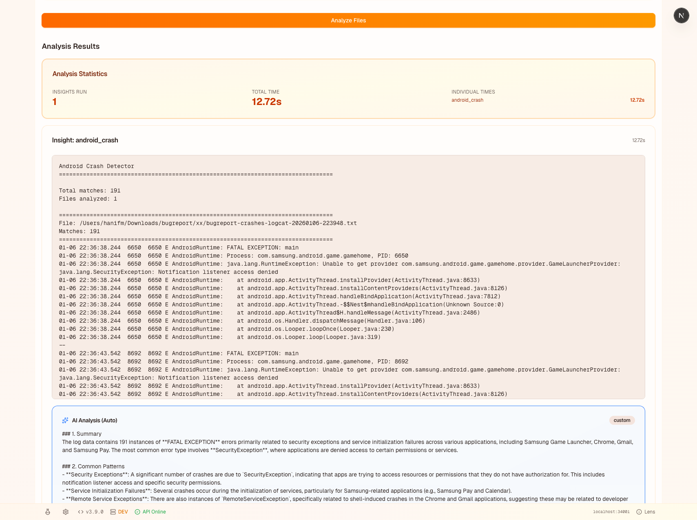
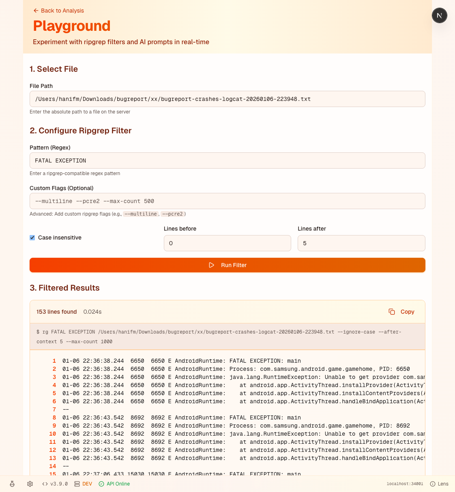

# Quick Start Guide

Get up and running with LensAI in minutes! This guide follows a progressive approach—start with the essentials, then explore advanced features when you're ready.

---

## Stage 1: Get Started

### Step 1: Install the Application

1. Visit the download page: **[https://hihanifm.github.io/awebees/](https://hihanifm.github.io/awebees/)**
2. Download the Windows installer:
   - **Self-Contained Installer** (recommended): Includes Python runtime, no additional setup needed
   - **Python-Required Installer**: Smaller download, requires Python 3.x already installed
3. Run the installer and follow the setup wizard
4. Launch LensAI from the Start menu or desktop shortcut

### Step 2: Load LensInsights Repository

1. Click the **Settings** icon (⚙️) in the status bar at the bottom of the application
2. Navigate to the **"Insights"** tab
3. In the "Insight Paths" section, enter the path to your LensInsights repository:
   ```
   <local-github-url>
   ```
   *(Replace `<local-github-url>` with the actual path to your LensInsights repository, e.g., `/Users/username/LensInsights` or `C:\Users\username\LensInsights`)*
4. Click **"Add Path"**
5. Click **"Refresh"** to load all insights from the repository


*Main interface showing file selection and available insights*

### Step 3: Your First Analysis

**Fastest way to get started:** Use the included sample file!

1. **Load the sample file**: Click the **"Load Sample File"** button on the main page
   - This automatically loads a 57MB Android bugreport sample (pre-extracted on first startup)
   - The file path will be pre-filled for you
   - Perfect for testing without needing your own log files

2. **Choose insights**: Select one or more insights from the list
   - Insights are organized by category
   - You can select multiple insights to run in parallel
   - Try "Error Detector" or "Line Count" for a quick test

3. **Analyze**: Click **"Analyze Files"** button
   - Watch real-time progress as files are processed
   - Results appear automatically when analysis completes

4. **View results**: 
   - See filtered content, statistics, and metadata
   - Expand individual results to see details
   - Export or copy results as needed


*Analysis results showing performance statistics and filtered content*

**Congratulations!** You've completed your first analysis. The application is now ready for regular use.

> **Using your own files?** Instead of clicking "Load Sample File", you can enter the absolute path to your log file (e.g., `/Users/username/logs/app.log` or `C:\Users\username\logs\app.log`). You can also analyze entire folders—they'll be scanned recursively.
>
> **Why absolute paths?** Due to browser security restrictions, file uploads aren't available. LensAI uses a local server component (running on your machine) that needs the full file path to access files on your local filesystem. This allows processing of large files efficiently without browser memory limitations—everything runs locally, no data leaves your computer.

---

## Stage 2: Explore More Features

### Playground - Test Filters Interactively

Ready to experiment with custom filters? The **Playground** lets you test ripgrep patterns and see results instantly—perfect for iterating on log analysis strategies.

**How to access:**
- Click the flask icon (🧪) in the status bar, or
- Navigate directly to `/playground` in your browser

**What you can do:**
- Test ripgrep patterns with immediate feedback
- Experiment with different filter configurations
- See performance metrics in real-time
- Save prompt templates for reuse


*Playground showing ripgrep filter configuration and filtered results*

📖 **Learn more:** See the [Playground Guide](PLAYGROUND.md) for detailed documentation.

---

## Stage 3: Unlock AI Power

Want deeper insights? Enable **AI-powered analysis** to get intelligent summaries, root cause analysis, and actionable recommendations.

**Quick Setup:**
1. Click **Settings** (⚙️) → **"AI"** tab
2. Toggle **"Enable AI Processing"**
3. Enter your API key (OpenAI, Azure OpenAI, or local LLM)
4. Click **"Test Connection"** to verify
5. Click **"Save"**

**Using AI Analysis:**
- After running an insight, click **"AI Analysis"** below the results
- Choose analysis type: Summarize, Explain, Recommend, or Custom
- Get streaming AI responses with intelligent insights


*AI-powered analysis providing summary, patterns, root causes, and recommendations*

> **Note:** AI is completely optional—LensAI works great without it! Enable AI when you want enhanced analysis capabilities.

📖 **Learn more:** See the [AI Setup Guide](docs/AI_SETUP.md) for detailed configuration options, including local LLM setup.

---

## What's Next?

- **Full Documentation**: Read the [README](README.md) for comprehensive feature documentation
- **Creating Custom Insights**: Check out [backend/app/insights/README.md](backend/app/insights/README.md) to build your own insights
- **Features Overview**: Explore [FEATURES.md](FEATURES.md) for detailed feature documentation
- **Windows Setup**: See [WINDOWS-SETUP-GUIDE.md](WINDOWS-SETUP-GUIDE.md) for Windows-specific instructions

---

**Happy analyzing!** 🔍✨
