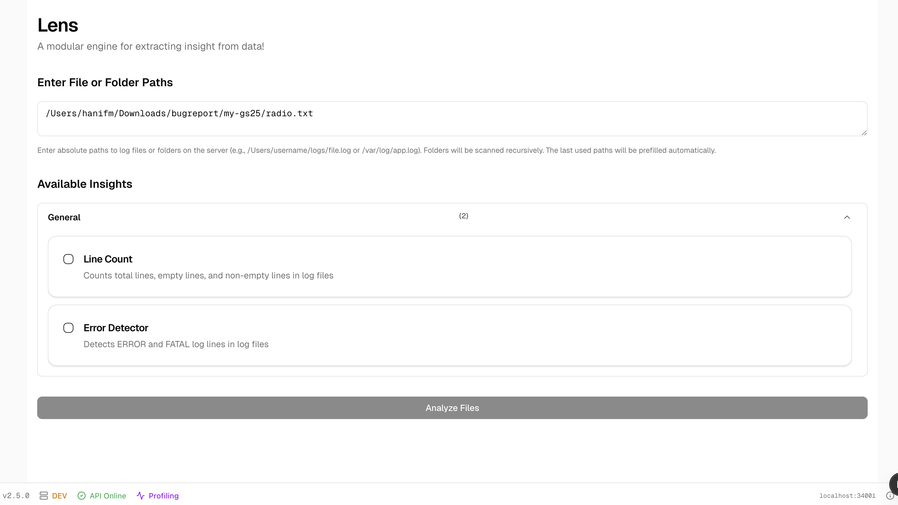
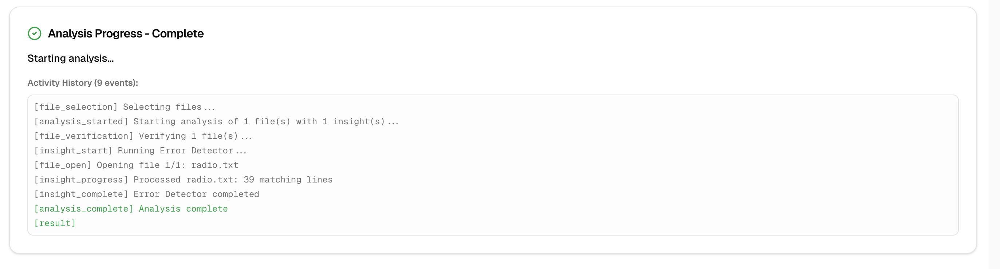
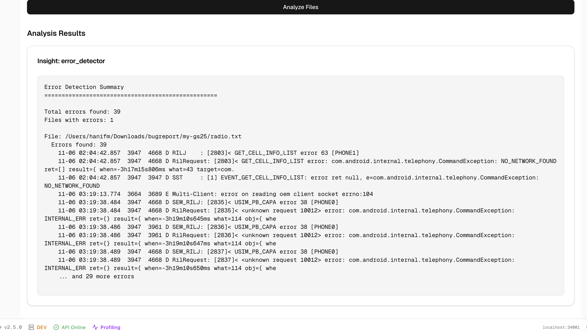

# Lens

A modular engine for extracting insight from data!

A local web application for analyzing log files with a plugin-based insight system.

## Architecture

- **Frontend**: Next.js App Router + TypeScript + shadcn/ui + Tailwind CSS (Port 5000)
- **Backend**: FastAPI + Python (Port 5001)

## Quick Start

### Prerequisites

- Python 3.x
- Node.js and npm
- Git

### Setup

1. Clone the repository:
   ```bash
   git clone <repository-url>
   cd awebees
   ```

2. Run setup script (one-time setup):
   ```bash
   ./scripts/setup.sh
   ```
   
   This will:
   - Create Python virtual environment
   - Install all dependencies (Python and Node.js)
   - Create `.env` files from examples

3. Start Services:
   ```bash
   ./scripts/start.sh        # Development mode (default)
   ./scripts/start.sh -p     # Production mode (builds frontend automatically)
   ```
   
   **Production Mode:**
   - Automatically builds the frontend and serves it from the backend
   - Single server on port 34001 (API + Frontend)
   - No separate frontend server needed
   
   **Development Mode:**
   - Separate servers: Frontend (34000) and Backend (34001)
   - Hot reload enabled for better development experience

5. Check Status:
   ```bash
   ./scripts/status.sh
   ```

6. View Logs:
   ```bash
   ./scripts/logs.sh        # Frontend logs (default)
   ./scripts/logs.sh -b     # Backend logs
   ```

7. Stop Services:
   ```bash
   ./scripts/stop.sh
   ```

## Configuration

### Environment Variables

Both frontend and backend use environment variables for configuration:

- **Backend**: See `backend/.env.example` - Copy to `backend/.env`
- **Frontend**: See `frontend/.env.example` - Copy to `frontend/.env.local`

Default ports:
- Frontend: 34000
- Backend: 34001

## Logs

Error and application logs are stored in the `logs/` directory:

- **Backend logs**: `logs/backend.log`
- **Frontend logs**: `logs/frontend.log`

View logs:
```bash
./scripts/logs.sh        # Frontend logs (last 20 lines)
./scripts/logs.sh -b     # Backend logs (last 20 lines)
tail -f logs/backend.log   # Backend logs (follow mode)
tail -f logs/frontend.log  # Frontend logs (follow mode)
```

## Features

Lens provides a modular plugin-based system for analyzing log files:



### Available Insights

- **Line Count**: Counts total lines, empty lines, and non-empty lines in log files
- **Error Detector**: Detects ERROR and FATAL log lines in log files

### Usage

1. **Enter File or Folder Paths**: 
   - Enter absolute paths to log files or folders on the server
   - Folders will be scanned recursively
   - The last used paths will be prefilled automatically
   - Example: `/Users/username/logs/file.log` or `/var/log/app.log`

2. **Select Insights**: 
   - Choose one or more insights to run on your files
   - Insights are organized by category (e.g., "General")

3. **Analyze**: 
   - Click "Analyze Files" to start the analysis
   - View real-time progress and results
   - Cancel analysis mid-flight if needed





### Status Indicators

The footer displays:
- **Version**: Current application version (e.g., v2.5.0)
- **Environment**: DEV or PROD
- **API Status**: Online/Offline
- **Profiling**: Indicates if backend profiling is enabled

## Development

**Development Mode:**
- Backend API docs: http://localhost:34001/docs
- Frontend: http://localhost:34000
- Version API: http://localhost:34001/api/version

**Production Mode:**
- Single server: http://localhost:34001 (serves both API and frontend)
- Backend API docs: http://localhost:34001/docs
- Frontend: http://localhost:34001

## Version Management

The project uses a unified versioning system with a single source of truth.

### Version File

The version is stored in `VERSION` at the project root. This is the single source of truth for the application version.

### Version Script

Use the version management script to manage versions:

```bash
./scripts/version.sh get              # Show current version
./scripts/version.sh set 0.2.0        # Set version to 0.2.0
./scripts/version.sh bump major       # Bump major version (1.0.0 -> 2.0.0)
./scripts/version.sh bump minor       # Bump minor version (1.0.0 -> 1.1.0)
./scripts/version.sh bump patch       # Bump patch version (1.0.0 -> 1.0.1)
./scripts/version.sh sync             # Sync version to package.json
```

### Version Endpoint

The backend provides a version endpoint:
- **GET** `/api/version` - Returns the current application version

### Release Workflow

1. Update the version using the version script:
   ```bash
   ./scripts/version.sh bump patch    # or major/minor
   ```

2. Update `CHANGELOG.md` with the changes for the new version

3. Commit the changes:
   ```bash
   git add VERSION CHANGELOG.md frontend/package.json
   git commit -m "Bump version to X.Y.Z"
   ```

4. Tag the release:
   ```bash
   git tag -a v$(./scripts/version.sh get) -m "Release v$(./scripts/version.sh get)"
   git push origin master
   git push origin --tags
   ```

## Project Structure

```
awebees/
├── backend/          # FastAPI backend
├── frontend/         # Next.js frontend
├── scripts/          # Management scripts
├── logs/             # Application logs
├── VERSION           # Application version (single source of truth)
├── CHANGELOG.md      # Version history
└── .cursor/          # Cursor IDE rules
```

